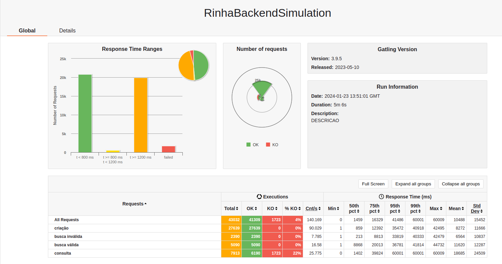

Minha versão da rinha de backend https://github.com/zanfranceschi/rinha-de-backend-2023-q3

### Tecnologias utilizadas

* Java 17
* Spring Boot 3
* PostgresSQL
* Nginx
* Maven
* Docker

## Autor
Jorge Melgarejo, melgarejo.colarte@gmail.com

